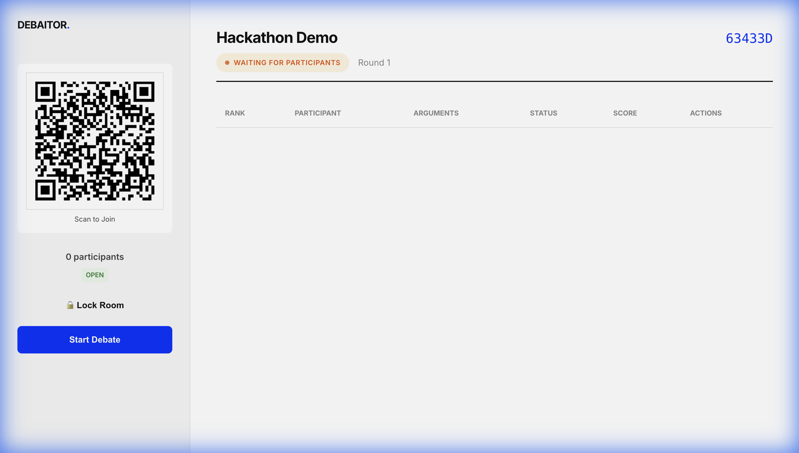
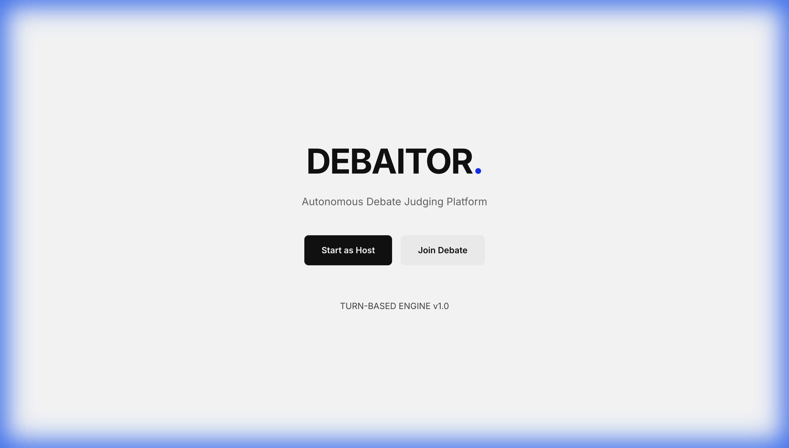

# DebAItor
**AI-Assisted Discussion & Debate Evaluation Platform**

### 🚀 [Live Demo: [https://debailtor.onrender.com](https://enigma-kohl-five.vercel.app)]

## Problem Statement
Evaluating discussions and debates is often subjective, biased, and inconsistent. In educational and professional settings, feedback typically focuses on "winning" or volume rather than logical structure, clarity, and relevance.

## Solution Overview
DebAItor is a real-time, AI-powered platform that objectively evaluates debate arguments based on *how* they are presented. It removes human bias by focusing strictly on logical reasoning, clarity, and relevance, ensuring fair and constructive feedback for every participant rather than just declaring a "winner" based on opinion.

## Key Features
*   **Four Unique Discussion Modes**:
    *   ⚔️ **Debate**: Competitive scoring with rankings and winner badges.
    *   📚 **Classroom**: Focus on learning, skill meters, and constructive feedback.
    *   🎙️ **Panel Discussion**: Emphasizes balanced participation and moderator insights.
    *   💼 **Meeting**: Executive summaries, actionable insights, and key takeaways.
*   **Live Room Creation**: Instant session setup with unique room codes.
*   **Seamless Joining**: Participants join instantly via QR code on any device.
*   **Structured AI Evaluation**: Arguments are scored on:
    *   **Clarity**: How understandable the point is.
    *   **Relevance**: Staying on topic.
    *   **Logic**: Coherence and reasoning structure.
    *   **Emotional Bias**: Objectivity vs. emotional appeal.
*   **Automated Reporting**: Generates detailed performance reports and transcripts.
*   **Persistent Sessions & Easy Reset**: Robust Firestore data handling ensures debates survive refreshes, and hosts can easily launch a new room post-debate.

## How It Works
1.  **Create Room**: Host starts a session and shares the QR code.
2.  **Join**: Participants scan to enter the debate lobby.
3.  **Debate**: Participants record audio arguments in turn-based rounds.
4.  **Evaluate**: AI analyzes audio for clarity, logic, and relevance.
5.  **Results**: View live scores and download a comprehensive report.

## Tech Stack
*   **Frontend**: HTML5, CSS3, Vanilla JavaScript
*   **Backend**: Node.js, Express
*   **Database**: Firebase Firestore
*   **AI & Processing**: Groq API, Whisper (Speech-to-Text)

## Screenshots

| Host Dashboard | Mobile Participant View |
|:---:|:---:|
|  |  |

| Landing Page | Create Room |
|:---:|:---:|
|  |  |

*Screenshots show the host management dashboard, mobile participant interface, and room creation flow.*

## Why This Matters
*   **PromotesFairness**: evaluating arguments on merit, not speaker charisma.
*   **Educational Value**: Teaches structured thinking and articulate speaking.
*   **Scalability**: Allows classrooms and groups to hold debates without needing expert human judges.

## Future Scope
*   **Multi-Language Support**: Breaking language barriers in debates.
*   **Team Mode**: Supporting 2v2 or 3v3 structured debates.

## Hackathon Note
Built as a high-impact submission for the hackathon.
